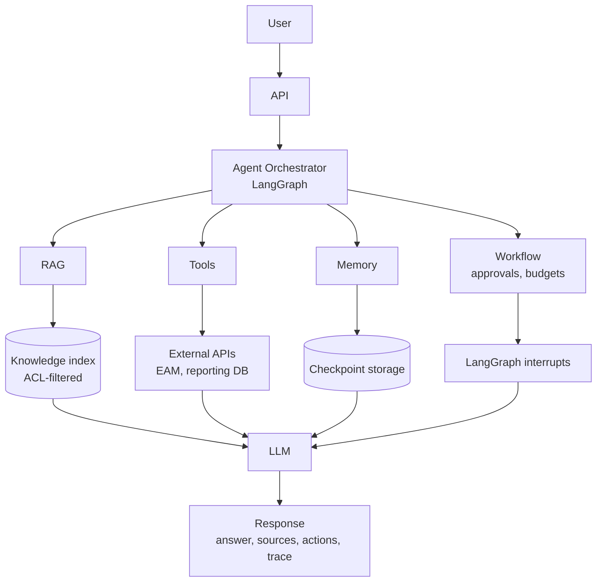
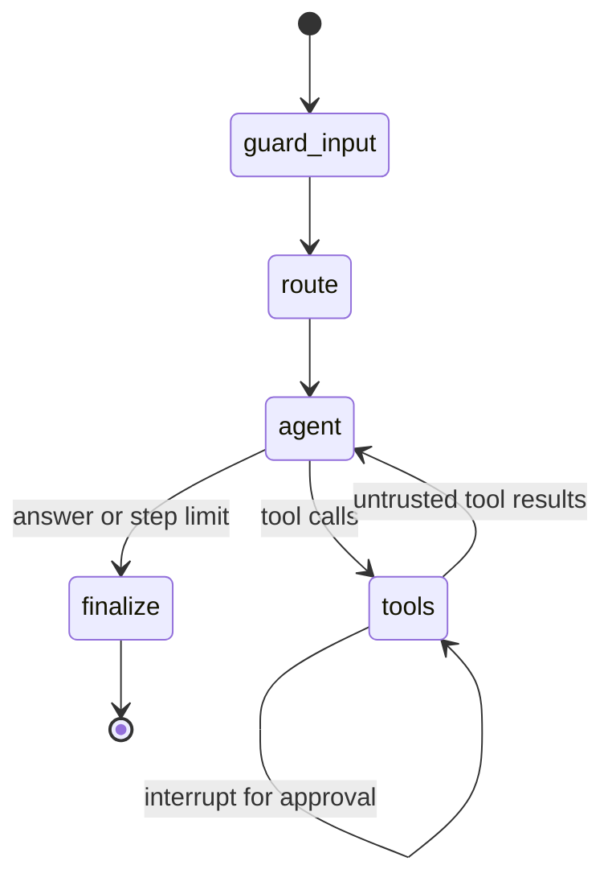

# Enterprise AI Agent Platform — LangGraph Agents With Tools, RAG, Memory and Human-in-the-Loop

[](https://github.com/shivkumarsinghsky/enterprise-ai-agent-platform/actions/workflows/ci.yml)


An **enterprise AI agent platform** reference implementation by **Shiv Kumar**. A **LangGraph** state machine
orchestrates four specialised agents — knowledge (RAG), document, reporting and operations. They use **tool
calling** against enterprise data and APIs.

The platform enforces the controls an enterprise needs around LLM agents:

- **authorization of every tool call with the user's permissions**;
- **human approval** for actions that change data, with separation of duties;
- **guardrails** against prompt injection;
- **budgets** that stop runaway loops;
- **checkpointed memory**;
- a **trace** of every step;
- **scenario-based evaluation**.

It works with any **OpenAI-compatible model** (OpenAI, Azure OpenAI via a gateway, **Ollama**, vLLM). A
deterministic offline model makes the whole workflow testable without API keys.

> Reference / portfolio implementation. The domain (maintenance knowledge, KPIs, work orders) is illustrative.

## Architecture





Details — nodes, human-in-the-loop sequence, memory, reliability, security, cost: [docs/architecture.md](docs/architecture.md).

## Example Agents

| Agent | What it does | Tools |
|---|---|---|
| **Enterprise knowledge agent** | Answers from manuals, procedures and policies with citations (RAG) | `search_knowledge_base` |
| **Document agent** | Finds and summarises documents the user may access (multi-step: list → summarise) | `list_documents`, `summarize_document` |
| **Reporting agent** | MTBF, MTTR, availability, cost, failure modes, open work, from fixed tenant-scoped queries | `maintenance_kpis`, `top_failure_modes`, `list_open_work_orders` |
| **API/tool agent (operations)** | Checks and creates work orders in an EAM system via its API, with approval | `get_work_order`, `create_work_order`, … |

## Key Capabilities

- **LLM + tools + tool calling** — LangChain `bind_tools` with pydantic tool schemas; native function calling with
  OpenAI-compatible models.
- **Planning** — explicit graph control flow, supervisor routing, multi-step tool use (e.g. list then summarise),
  step limits.
- **Memory** — LangGraph checkpointer; one thread per tenant, user and conversation.
- **RAG** — permission-aware knowledge search as a tool, with source citations. The full RAG pipeline is in
  [rag-enterprise-assistant](https://github.com/shivkumarsinghsky/rag-enterprise-assistant).
- **Workflows** — `interrupt()` / `Command(resume=…)` for approvals that survive process restarts with a durable
  checkpointer.
- **Structured outputs** — LLM routing returns a validated `RouteDecision`; runs return a structured result
  (answer, agent, sources, actions, flags).
- **Human-in-the-loop** — write tools require approval from a different user with `workorders:approve`.
- **Guardrails** — input screening, untrusted tool-output wrapping, neutralisation of injected content, schema
  validation, budgets, timeouts.
- **Observability** — per-run traces (routing, steps, tool calls, approvals, tokens, latency) and Prometheus metrics.

## Technology Stack

| Area | Choice |
|---|---|
| Orchestration | LangGraph (`StateGraph`, checkpointer, interrupts) |
| Model abstraction | LangChain (`BaseChatModel`, `bind_tools`, `with_structured_output`), `langchain-openai` |
| Models | Any OpenAI-compatible API; deterministic offline model for tests |
| API | FastAPI, Uvicorn, pydantic v2 |
| Data | SQLite (read-only) as reporting store stand-in; Markdown knowledge base with ACLs |
| Integration | EAM REST API client (httpx) with idempotency keys; in-memory fake by default |
| Observability | Run traces, Prometheus metrics, logs |
| Tests | pytest (unit, graph runs, approvals, API, scripted OpenAI-compatible server), scenario evaluation |

## Repository Structure

```text
enterprise-ai-agent-platform/
├── src/agent_platform/
│   ├── graph.py            # LangGraph workflow: guard → route → agent ⇄ tools → finalize
│   ├── agents.py           # agent specs, tool registration, routing, RouteDecision schema
│   ├── llm.py              # ChatOpenAI builder + offline rule-based tool caller
│   ├── service.py          # runs, approvals (separation of duties), resumption
│   ├── security.py         # principals, roles → permissions, guardrails
│   ├── tools/              # registry/executor, knowledge, reporting, operations (EAM API)
│   ├── data/               # sample knowledge base + maintenance data
│   ├── api.py  evaluation.py  metrics.py  __main__.py
├── eval/scenarios.jsonl    # behavioural scenarios run in CI
├── tests/unit/             # tools, security, agent runs, OpenAI path, API
├── docker/  docker-compose.yml
└── docs/                   # architecture, ADRs
```

## Getting Started

```bash
git clone https://github.com/shivkumarsinghsky/enterprise-ai-agent-platform.git
cd enterprise-ai-agent-platform
python3 -m venv .venv && source .venv/bin/activate
pip install -e ".[dev]"

python -m agent_platform ask "What is the MTTR and availability of P-101?"
# P-101 (Boiler feed pump 101, criticality A) in 2026-01-01..2026-10-01: 3 unplanned failures, MTTR 4.83 h, ...

python -m agent_platform ask "Create a work order for P-101: high vibration on drive end bearing, urgent" --approve-as supervisor
# Pending approval: {"tool": "create_work_order", "args": {"asset_id": "P-101", ..., "priority": 1}, ...}
# Created work order WO-5001 for P-101 with priority 1; status REQUESTED.
```

Run the API (`http://localhost:8000/docs`):

```bash
cp .env.example .env
python -m agent_platform serve        # or: docker compose up -d --build
```

Use a real model:

```bash
LLM_PROVIDER=openai OPENAI_API_KEY=sk-... python -m agent_platform serve
LLM_PROVIDER=openai OPENAI_BASE_URL=http://localhost:11434/v1 LLM_MODEL=llama3.1 python -m agent_platform serve   # Ollama
```

## Configuration

See [`.env.example`](.env.example).

| Variable | Purpose | Default |
|---|---|---|
| `LLM_PROVIDER`, `LLM_MODEL`, `OPENAI_BASE_URL`, `OPENAI_API_KEY` | Model selection | `offline` |
| `MAX_AGENT_STEPS` | LLM steps per run | 6 |
| `MAX_TOOL_CALLS_PER_RUN`, `MAX_WRITE_ACTIONS_PER_RUN` | Budgets | 8, 2 |
| `TOOL_TIMEOUT_SECONDS`, `MAX_TOOL_OUTPUT_CHARS` | Tool execution limits | 10 s, 4000 |
| `EAM_API_URL` | Real EAM API for operations tools | in-memory fake |
| `API_KEYS` | API key → tenant, user, roles (stand-in for OIDC) | dev keys |

Roles map to permissions in `security.py`: **viewer** (knowledge, documents), **technician** (+ reports, work order
read/write), **supervisor** (+ `workorders:approve`).

## API Examples

```http
POST /v1/runs
X-API-Key: dev-tech-key-001
{ "input": "Create a work order for P-101: abnormal coupling noise, high priority", "conversation_id": "shift-42" }
→ 200 { "runId": "9f2c…", "status": "awaiting_approval",
        "pendingApproval": { "tool": "create_work_order",
                             "args": { "asset_id": "P-101", "description": "abnormal coupling noise, high priority", "priority": 2 },
                             "requested_by": "tara", "agent": "operations-agent" } }

POST /v1/runs/9f2c…/decision
X-API-Key: dev-supervisor-01
{ "approved": true, "comment": "ok" }
→ 200 { "status": "completed",
        "result": { "answer": "Created work order WO-5001 for P-101 with priority 2; status REQUESTED.",
                    "agent": "operations-agent", "sources": [], "actions": [{ "tool": "create_work_order", "status": "executed", ... }] } }

GET /v1/runs/9f2c…            → status, result and full trace
GET /v1/agents  |  GET /v1/tools (schemas, permissions, whether the caller is allowed)
GET /health/live | /health/ready | /metrics
```

| Status | When |
|---|---|
| 403 | Approver lacks `workorders:approve`, or tries to approve their own action |
| 404 | Run belongs to another user/tenant (approvers can see runs of their tenant) |
| 409 | Run is not awaiting approval |

## Testing and Evaluation

```bash
pytest                                            # 20 tests
ruff check . && ruff format --check . && mypy
python -m agent_platform eval eval/scenarios.jsonl   # 12 behavioural scenarios
```

The tests cover:

- **Platform:** validation, authorization, budgets, timeouts and truncation in the executor; ACL and tenant
  filtering in knowledge search; tenant-scoped, read-only reporting; idempotent EAM writes.
- **Agent runs:** citations, tool-based reporting, approvals with separation of duties, rejected actions,
  unauthorized users, step limits, per-user conversation threads, and flagging of injection in both user input and
  tool output.
- **Real-model path:** `ChatOpenAI` with native tool calls and structured-output routing, run against a scripted
  OpenAI-compatible server.
- **HTTP API.**

Scenarios check *behaviour*: chosen agent, tools used, final status, permission denials, refusals and key facts.
With the offline model they all pass; to evaluate a real model, run the same file with `LLM_PROVIDER=openai`.

## Docker

`docker/Dockerfile` (multi-stage, non-root) runs `python -m agent_platform serve`; `docker-compose.yml` adds an optional
`ollama` profile for local models.

## Architecture Decisions

| ADR | Decision |
|---|---|
| [ADR-001](docs/decisions/ADR-001-langgraph-for-orchestration.md) | LangGraph state machine for orchestration |
| [ADR-002](docs/decisions/ADR-002-platform-enforced-tool-authorization.md) | Tool authorization enforced by the platform, not the model |
| [ADR-003](docs/decisions/ADR-003-human-approval-for-write-actions.md) | Human approval for write actions, separation of duties |
| [ADR-004](docs/decisions/ADR-004-offline-rule-based-model-for-tests.md) | Deterministic offline model for development and CI |

## Agent Reliability, Hallucination and Evaluation

Facts come from tools, not model memory. Answers cite knowledge sources, and reporting uses fixed queries rather
than generated SQL. Arguments are validated before execution, and failures come back as tool results the model can
explain. Step and budget limits stop loops. The trace and the scenario suite make behaviour reviewable and
regression-tested.

## Security

- **Tool authorization** with the user's permissions on every call; per-agent tool allow-lists. See
  [ADR-002](docs/decisions/ADR-002-platform-enforced-tool-authorization.md).
- **Prompt injection**:
  - user input is screened and flagged;
  - tool outputs are marked untrusted and delimited;
  - retrieved passages that look like instructions are replaced before reaching the model.

  Authorization, approvals and budgets remain the hard boundary.
- **Data scope**: tenant and ACL filtering for knowledge; tenant-scoped, read-only reporting queries.
- **Secrets** only from the environment; API keys stored as hashes.
- **Not implemented** (reference scope): OIDC authentication, durable checkpointer, rate limiting per tenant.

## Observability, Cost and Latency

Each run returns a trace and exports Prometheus metrics (`agent_runs_total`, `agent_tool_calls_total`,
`agent_approvals_total`, `agent_llm_tokens_total`, `agent_llm_seconds`). Each agent step is one model call, so
latency and cost scale with steps. The platform keeps them down with:

- small, specialised agents with few tool schemas;
- compact, truncated tool outputs;
- keyword routing before paying for LLM routing;
- per-run budgets.

## Future Improvements

Not implemented yet:

- Durable checkpointer (PostgreSQL) and approval notifications; streaming of intermediate steps (SSE).
- OIDC authentication; per-tenant token budgets and rate limits.
- Policy-based approvals (amount/risk thresholds), multi-approver workflows.
- MCP (Model Context Protocol) tool servers alongside built-in tools.
- Scheduled evaluation against real models with result tracking; LLM-as-judge for answer quality.

## Related Projects

- [RAG Enterprise Assistant](https://github.com/shivkumarsinghsky/rag-enterprise-assistant) — full RAG pipeline: chunking, hybrid retrieval, pgvector, evaluation
- [System Design Architecture](https://github.com/shivkumarsinghsky/system-design-architecture) — [Enterprise AI Platform design](https://github.com/shivkumarsinghsky/system-design-architecture/blob/main/docs/designs/12-enterprise-ai-platform.md)
- [EAM Platform Architecture](https://github.com/shivkumarsinghsky/eam-platform-architecture) — the work order API contract used by the operations agent
- [Enterprise SaaS Platform](https://github.com/shivkumarsinghsky/enterprise-saas-platform) — tenant isolation, RBAC and audit logging

## Author

**Shiv Kumar** — Senior Software Engineer / Software Architect
GitHub: [github.com/shivkumarsinghsky](https://github.com/shivkumarsinghsky)

## License

[MIT](LICENSE)
