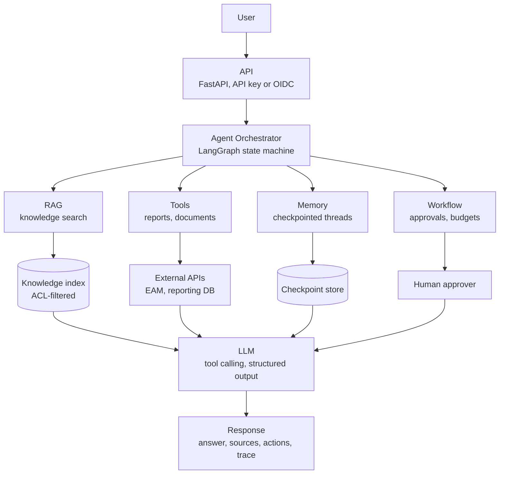
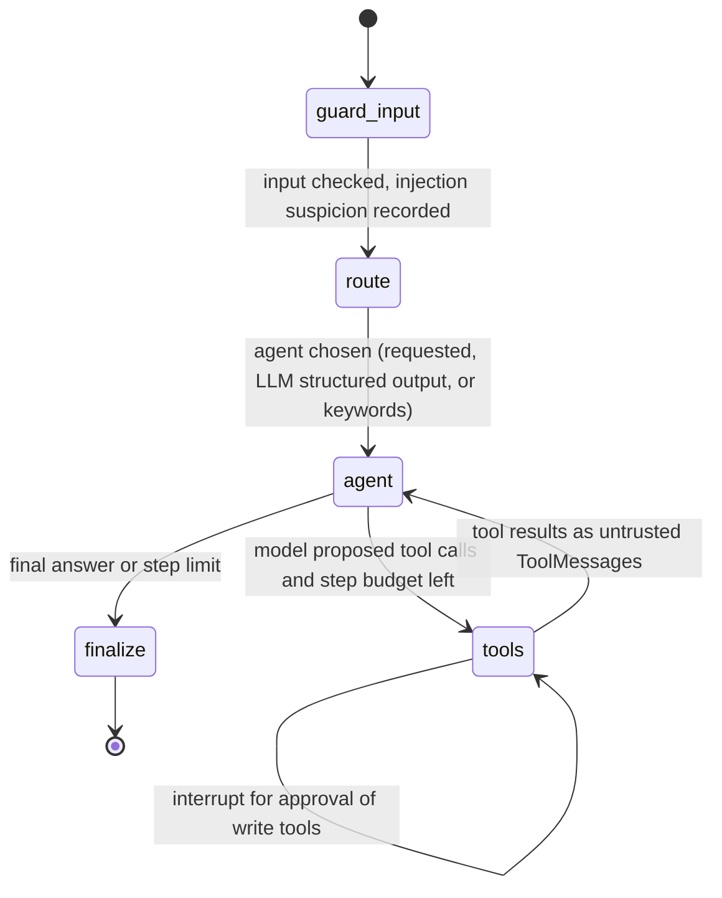
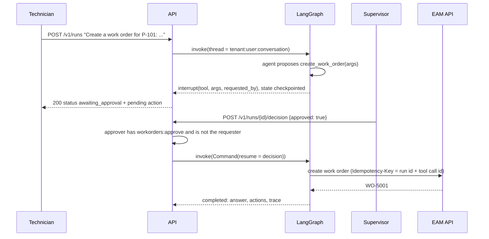

# Architecture

## Goals

- Let users ask questions and perform tasks across enterprise knowledge, reports and business systems in natural
  language.
- Keep the **platform** in control: the model proposes, the platform authorizes, executes, records and — for
  actions that change data — asks a human.
- Make every run explainable after the fact (which agent, which tools, which data, which approvals).

## Reference architecture

## The graph

| Node | Responsibility |
|---|---|
| `guard_input` | Validate input size, flag prompt-injection patterns, reset per-run counters |
| `route` | Supervisor routing to one of four agents; with a real LLM this is a **structured output** (`RouteDecision`) |
| `agent` | Call the model with the agent's system prompt and **only that agent's tool schemas**; record latency and tokens |
| `tools` | For each proposed call: approval interrupt for write tools → authorization → schema validation → budgets → execution with timeout → untrusted, truncated output; neutralise injected content in retrieved passages |
| `finalize` | Build the structured result: answer, agent, cited sources, executed/rejected actions, flags |

Agents are configuration (`agents.py`): a name, a description used for routing, a system prompt and a tool allow-list.

| Agent | Tools | Example |
|---|---|---|
| knowledge-agent | `search_knowledge_base` | "How long does the P-101 seal replacement take?" |
| document-agent | `list_documents`, `summarize_document` | "Summarize the lock-out tag-out procedure" |
| reporting-agent | `maintenance_kpis`, `top_failure_modes`, `list_open_work_orders` | "What is the MTTR of P-101?" |
| operations-agent | `get_work_order`, `create_work_order`, `list_open_work_orders`, `search_knowledge_base` | "Create a work order for P-101: coupling noise" |

## Human-in-the-loop

Design points:

- The pause is a **checkpoint**, not a blocked thread: with a persistent checkpointer (PostgreSQL/SQLite saver) a run
  can wait hours and resume in another process.
- **Separation of duties**: requesters cannot approve their own actions.
- **Idempotency**: a resumed or retried run cannot create the work order twice.
- Rejections are returned to the model as a tool result, so it explains the outcome instead of retrying.

## Memory

| Kind | Implementation | Scope |
|---|---|---|
| Short-term (conversation) | LangGraph checkpointer; thread id `tenant:user:conversation` | One conversation; last 20 messages sent to the model |
| Run state | Same checkpoint (steps, budgets, sources, actions, trace) | One run |
| Long-term knowledge | The knowledge base (RAG), not the chat history | Tenant, ACL-filtered |

The reference uses an in-memory checkpointer; production uses a durable saver (e.g. PostgreSQL) with retention.

## Agent reliability

| Risk | Control |
|---|---|
| Infinite tool loops | `MAX_AGENT_STEPS`, LangGraph recursion limit |
| Runaway cost or side effects | Per-run tool-call and write-action budgets |
| Hallucinated values | Facts come from tools; answers cite sources; tools return structured data; fixed queries instead of text-to-SQL |
| Invalid tool arguments | Pydantic schemas validated by the platform before execution |
| Slow dependencies | Per-tool timeout; errors returned as tool results so the model can explain them |
| Wrong agent | Routing is observable in the trace; scenario evaluation checks routing |
| Model/provider outage | Timeouts and retries in the client; the offline mode keeps the platform testable |

## Security

- **Authorization is enforced by the platform on every tool call** with the *user's* permissions, never the model's.
  A model that is tricked into calling `create_work_order` for a viewer gets "not authorized".
- **Tool allow-lists per agent**: an agent only receives the schemas of its tools and cannot execute others.
- **Prompt injection**: user input is screened and flagged; tool outputs are wrapped as untrusted data; retrieved
  passages that look like instructions are replaced before reaching the model. These heuristics reduce risk; the hard
  boundaries are authorization, approvals and budgets.
- **Data scope**: knowledge search filters by tenant and ACL groups; reporting queries are fixed, parameterised,
  tenant-scoped and run on a read-only connection.
- **Secrets**: provider keys only via environment; API keys held as SHA-256 hashes.

## Observability and evaluation

- Every run returns a **trace**: input guard result, routing decision and method, each agent step (tool calls,
  latency, tokens), each tool execution (ok/error, latency), approvals and the finalisation.
- Prometheus metrics: `agent_runs_total`, `agent_tool_calls_total`, `agent_approvals_total`,
  `agent_llm_tokens_total`, `agent_llm_seconds`.
- **Scenario evaluation** (`eval/scenarios.jsonl`) checks behaviour, not just text: chosen agent, tools used,
  status (completed / awaiting approval), permission denials, refusals and key facts in answers. It runs in CI.

## Cost and latency

Each agent step is one LLM call, so cost and latency scale with steps: a typical question needs two steps (tool call,
answer); multi-step tasks need more. Levers: tool results designed to be compact (truncated at
`MAX_TOOL_OUTPUT_CHARS`), routing to small specialised agents with few tool schemas, keyword routing before
paying for LLM routing, cheaper models for routing, and per-run budgets. Token usage per step is in the trace.
